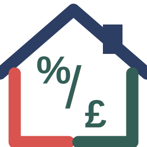

<p align="center">
  
</p>

# FairShare - Fair Bill Splitting Calculator

[](https://github.com/DrizzlyOwl/FairShare/actions/workflows/static.yml)
[](https://github.com/DrizzlyOwl/FairShare)
[](https://github.com/DrizzlyOwl/FairShare)
[](https://opensource.org/licenses/Apache-2.0)
[](https://deepmind.google/technologies/gemini/)

**FairShare** is a modern, high-performance web utility designed to help couples determine a fair and proportionate way to split household expenses. By moving beyond the standard 50/50 split—which can be inequitable when salaries differ significantly—this tool calculates contributions based on each partner's relative earning power.

> [!TIP]
> **[🚀 Try the Live Demo](https://drizzlyowl.github.io/FairShare/)**

---

## 📍 Table of Contents
- [🌟 Project Overview](#-project-overview)
- [🏗️ Technical Architecture](#%EF%B8%8F-technical-architecture)
- [📁 Project Structure](#-project-structure)
- [🚀 Installation](#-installation)
- [📖 Usage](#-usage)
- [🤝 Contribution](#-contribution)
- [🙌 Acknowledgments](#-with-thanks-to)

---

## 🌟 Project Overview

FairShare automates household budgeting by establishing a contribution ratio based on relative income. It ensures both partners retain a fair share of disposable income, removing financial friction. 

### ✨ Key Features
- **🧠 Smart Ratio Calculation**: Automatically estimates net monthly take-home pay (after tax and NI) to ensure contribution ratios are truly fair.
- **🌗 Dark Mode & Themes**: Fully themed UI with native support for system preferences and manual overrides.
- **📊 Detailed Roadmap**: Generates a final report separating **Initial Upfront Costs** from **Ongoing Monthly Shares**.
- **🌐 Real-World Data**: Fetches estimated property values via the UK Land Registry SPARQL endpoint.
- **⚡ PWA Ready**: Fully installable on iOS and Android with offline functionality.
- **♿ Accessibility First**: Strictly **WCAG 2.1 AA** compliant with legible typography and keyboard navigation.

---

## 🏗️ Technical Architecture

FairShare is built using a **Decoupled Modular Design** powered by ES6 modules. This architecture ensures high maintainability and testability without the overhead of a framework.

### 1. Core Concepts & Design Patterns
- **Reactive State (Proxy Pattern)**: State in `State.js` is wrapped in a Javascript Proxy, triggering UI renders and `localStorage` sync automatically.
- **Pure Functional Logic**: All financial logic in `FinanceEngine.js` consists of side-effect-free pure functions.
- **Specialized Controllers**:
    - **`NavigationController`**: Manages hash-based routing and keyboard navigation.
    - **`FormController`**: Handles input life-cycles and real-time validation.
    - **`UIManager`**: Orchestrates BEM-compliant DOM updates.

### 📁 Project Structure
```text
fairshare/
├── src/                # Application Source
│   ├── core/           # Business Logic & State
│   ├── services/       # External API Integrations
│   ├── ui/             # View Orchestration
│   └── utils/          # Formatting & Helpers
├── scripts/            # Build & Automation Utilities
├── cypress/            # E2E & A11y Tests
├── unit/               # Logic Unit Tests
├── icons/              # SVG Asset Library
├── style.css           # Modern CSS (Nesting, Variables)
└── index.html          # Application Entry Point
```

---

## 🚀 Installation

### Prerequisites
- [Node.js](https://nodejs.org/) (v18 or higher recommended)

### Setup
1. Clone the repository:
   ```sh
   git clone https://github.com/DrizzlyOwl/FairShare.git
   cd FairShare
   ```
2. Install dependencies:
   ```sh
   npm install
   ```

---

## 📖 Usage

### Running Locally
```sh
npm start
```
The application will be available at `http://localhost:8080`.

### Build & Versioning
This project uses an automated build stamp utility. Before pushing any changes:
```sh
npm run bump
```
This automatically increments the build version, updates the GMT footer timestamp, and refreshes asset cache busters.

---

## 🧪 Testing

FairShare maintains high quality through comprehensive testing:

### Running All Tests
```sh
npm test
```

### Individual Test Suites
- **Unit Tests**: `npm run test:unit`
- **Cypress E2E**: `npm run test:cypress`
- **Accessibility (WCAG)**: `npm run test:a11y`

### Coverage Report
To generate a local HTML coverage report:
```sh
npm run test:coverage
```
The report will be available in the `coverage/` directory.

---

## 🤝 Contribution

Contributions are welcome! Please follow these guidelines:
1. **BEM Naming**: Ensure all changes adhere to the Block-Element-Modifier convention.
2. **A11y**: Maintain **WCAG 2.1 AA** compliance (validated via `npm run test:a11y`).
3. **Docs**: All new functions must include **DocBlock** style comments.
4. **Validation**: Execute `npm run bump` before pushing to ensure version integrity.

## 🙌 With thanks to

Special thanks to the following users for their invaluable help with testing, bug reporting, and feature suggestions:
- [dynamictulip](https://github.com/dynamictulip)
- [yndajas](https://github.com/yndajas)
- @greenfingeredgec

## 📜 License

This project is licensed under the **Apache License, Version 2.0**.

---

**Vibe coded by Ash Davies (DrizzlyOwl) and Gemini.**

### 🤖 About the AI Agent
This project is co-piloted and maintained by **Gemini CLI**, an interactive autonomous agent powered by **Google Gemini 2.0** models.

**Agent Capabilities & Facts:**
- **Autonomous Lifecycle**: Gemini CLI manages the entire development lifecycle—Research, Strategy, and Execution.
- **Surgical Refactoring**: The agent performs precise code modifications while strictly adhering to architectural mandates.
- **Validation Focused**: It prioritizes empirical reproduction of issues and validates every change through automated test suites.
- **Project Context Awareness**: Operates with deep understanding of local project standards and engineering constraints.
